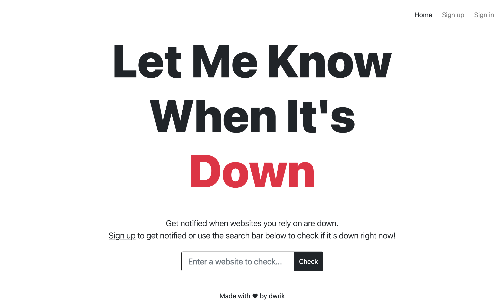

# Let Me Know When It's Down

Get notified when websites you rely on are down!

## Description

Web application which tracks the availability of websites on the internet.

The search bar allows for instantly checking if a website is down.

Signing up for a free account however allows users to track multiple websites at once and receive email alerts when any of those websites are down.

This is made possible by running cron jobs on the backend that check the availability of the tracked sites at regular intervals and notify the affected users if any.

## Features

- Check if websites are down right now using the search bar
- Sign up for free to get notified when websites are down
- Add or remove websites to track their availability
- Receive downtime alerts on your registered email when tracked websites are down
